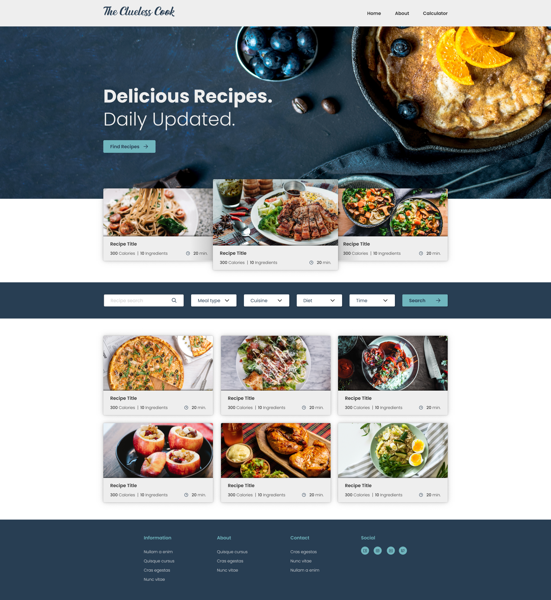
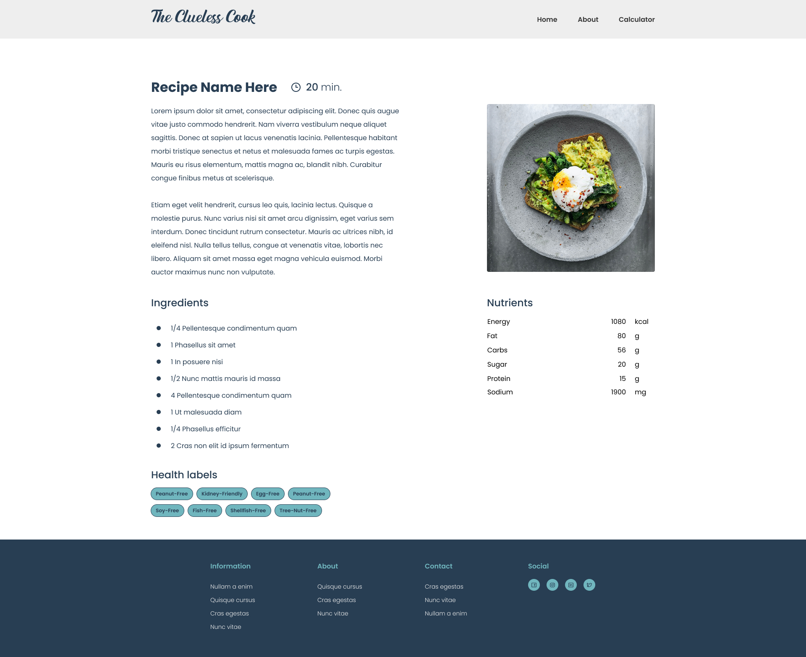
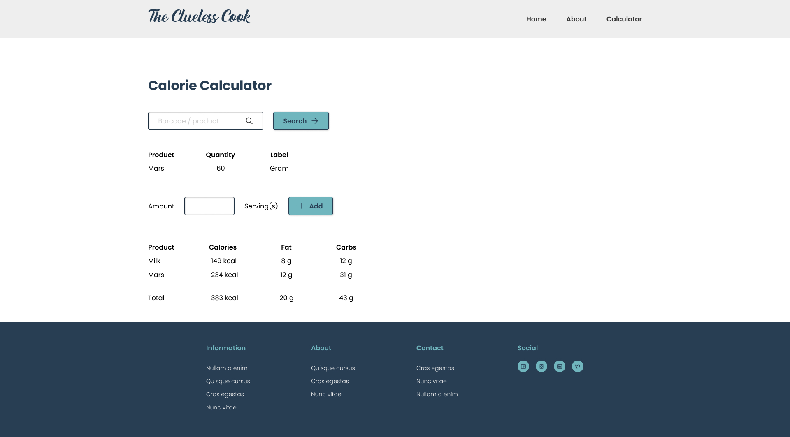

1. This is the installation manual for the application. The application has three pages:
- Homepage
- Recipe page
- Calculator page

On the homepage you can type a recipe or ingredient in the search field
based on recipe type, kitchen, diet or preparation time. After typing our 
preferences in the search field, recipes will appear, and you can click on 
a recipe image that will lead you eventually to the recipe page where you 
can find all cooking instructions along with its nutrition and ingredients.

Last but not least, on the calculator page you can type a food product that 
will show you the corresponding service size. Moreover, you can add the 
selected product with the amount of servings by choice. It will show you a 
table with the added amount of products, along with its calories, fat and 
carb data.

Preview:

Homepage

Recipe page

Calculator

2. Installation

To be able to use this application, there are some steps that needs to be taken 
to complete the installation. 

First of all, you need to install node.js and npm in the terminal below by typing 
npm install -v. After you have done that, you should install axios. You will see 
a package.json file on the left side in your project. 

Then you should create an API key from the Edamam website: 
[https://www.edamam.com/](https://www.edamam.com/). You will need three API keys 
along with its API ID number. Those API keys and ID's you will need when creating 
the homepage, recipe page and calculator page.

For the homepage and recipe page you will need the Recipe Search API key and id.
For the calculator page the Food API key and id.

3. Running the project

When typing npm run start in the terminal, you will be able to click on the link
below and see the application.

